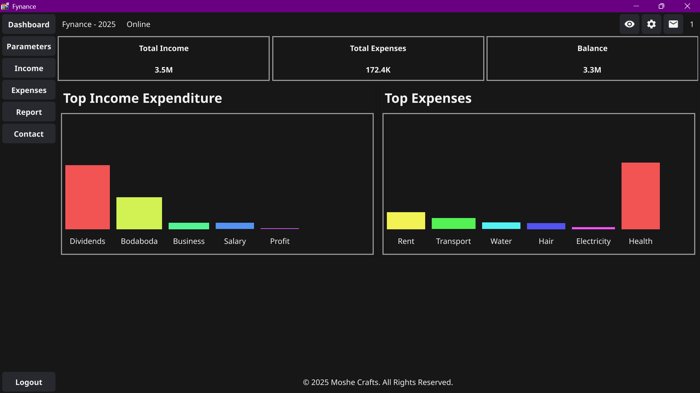

# Fynance – Expense Tracker

Version: 1.7.1  
Developed by: Clinton Moshe  
Date: 11/01/2026

Introduction:  
Welcome to Fynance, a simple and efficient expense tracking desktop application
designed to help individuals and businesses manage their income and expenses.
With Fynance, you can track your financial transactions, generate reports,
and gain insights into your spending habits.

Features:  
✔ Expense Management: Add, update, delete, and categorize expenses.  
✔ Income Management: Record and track income sources.  
✔ Export Data: Export financial reports to CSV.  
✔ Dark/Light Mode: Switch between themes for better usability.  
✔ User Authentication: Secure login with password protection.

System Requirements:

- Operating System: Windows 7 or higher (32-bit or 64-bit)
- Processor: 1 GHz or higher
- RAM: 1 GB or more
- Disk Space: 50 MB or more available space
- Database: MongoDB

Installation Instructions:

1. Download [Fynance](https://moshecrafts.com/apps/fynance.exe).
2. Run the installer and follow the on-screen instructions.
3. Choose the location where you want the application to be installed.
4. Once installed, launch Fynance from the Start Menu or desktop shortcut.

How to Use:

1. First-Time Setup: Create an admin account when opening the app for the first time.
2. Login: Use your credentials to access the dashboard.
3. Add Income & Expenses: Enter financial transactions under the Income or Expenses section.
4. View Reports: Check the Reports section for a detailed breakdown of income vs. expenses.
5. Export Data: Save financial reports as CSV for record-keeping.

Contact For custom softwares:  
For any assistance or inquiries, contact:  
📧 Email: clintonmwachia9@gmail.com  
📞 Phone: +254746646331 / +254738816913

Thank you for choosing Fynance! We hope this tool helps you take control of your finances with ease.

==================================================
